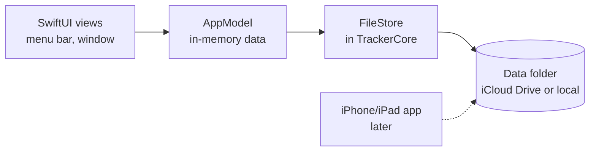

# Time Tracker for Mac — Plan

Sep 23, 2026 · Johannes <mail@j23n.com>

## Overview

A native SwiftUI time tracker for Mac, with iPhone and iPad later. It stores everything as readable JSON files, never touches the network, and ships on the Mac App Store.

Core requirements: a menu bar app with clients, projects and tags, one timer at a time, easy editing of logged work, simple reports and CSV export. Data lives in iCloud Drive or locally, never in a third-party cloud service.

| Question | Decision |
| --- | --- |
| Data files | Readable JSON, edited only in the app |
| Devices | Macs now, iPhone and iPad later |
| Distribution | Mac App Store |
| Timers | One at a time |
| Project structure | Client → project; a project may have no client |
| Storage location | The app's iCloud Drive folder or local; no custom folders |
| Overlapping entries | Allowed, but highlighted |
| Report totals | Each entry counted in full, matching the CSV |

The hard part is sync: several devices write to the same folder, sometimes offline, and nothing may be lost. Most of the rules below exist for that.

## Architecture

The app is sandboxed without the outgoing-network entitlement, so macOS itself blocks every connection. iCloud Drive syncing is done by macOS in the background, not by the app.



Views talk only to the app model; only the file store touches disk.

- **Permissions (entitlements):** App Sandbox, iCloud Documents for the app's own container, and read-write access to files the user picks (for CSV export). Nothing else. The App Store privacy label can say "Data Not Collected."
- **Shared core:** a `TrackerCore` Swift package holds the models, JSON encoding, merging, the two-timers rule, overlap detection, the file store, report builder and CSV exporter. It has no SwiftUI code, is fully unit-tested, and is reused by the iOS app.
- **File store:** an actor, so file work never runs on the main thread. Apple warns that `url(forUbiquityContainerIdentifier:)` and coordinated file access can block for a long time. The store reaches the disk through a small protocol with two versions: plain file access for the local folder and tests, and `NSFileCoordinator` for iCloud.
- **App model:** an `@Observable` `AppModel` on the main actor keeps all clients, projects and entries in memory. Years of entries come to a few megabytes. Edits go through methods such as `start`, `stop`, `update` and `delete`, which register an undo action, mark the affected months as changed and schedule a save.
- **Undo:** Cmd-Z works for every edit, including timeline drags, bulk changes in the table and deletes. Undoing a delete clears its `deleted` timestamp.
- **Scenes:** `MenuBarExtra` with the `.window` style for the popover, a main `Window`, and `Settings`. `MenuBarExtra` has had no public API to open or close the popover from code, for example to close it after starting a timer. If the current SDK still has none, use the MenuBarExtraAccess package or an `NSStatusItem` with an `NSPanel`.
- **Minimum macOS 14:** the first version with `@Observable` and SwiftUI's inspector panel.
- **Dock icon:** shown only while the main window or Settings is open, by switching the app's activation policy. Opening either window activates the app first; otherwise the window appears behind the frontmost app.
- **No SwiftData or Core Data:** they store a database rather than readable files.

## Storage and file format

Entries live in one JSON file per month, next to a single `projects.json`. The app writes them with its own small JSON writer: sorted keys, two-space indents, short lists on one line, and records in a fixed order (entries by start, clients and projects by name). The same data therefore always gives the same file, whatever the OS version.

```
Time Tracker/             ← iCloud Drive, or the app's local folder
├── projects.json         clients and projects
└── entries/
    ├── 2026-08.json
    └── 2026-09.json      one file per month, by start date
```

A single entry in a month file:

```json
{
  "end": "2026-09-23T11:40:00+02:00",
  "endUpdated": "2026-09-23T11:40:00.412+02:00",
  "id": "2F6A1C9E-…",
  "note": "Wireframe review",
  "project": "8B41D7A0-…",
  "start": "2026-09-23T09:15:00+02:00",
  "tags": ["design", "client-call"],
  "timeZone": "Europe/Berlin",
  "updated": "2026-09-23T11:41:02.187+02:00"
}
```

The models in `TrackerCore`:

```swift
/// Milliseconds since 1970 (UTC). An integer, so every device compares times exactly.
struct Timestamp: Hashable, Comparable {
    var milliseconds: Int64
}

struct Client: Identifiable {
    let id: UUID
    var name: String
    var archived: Bool
    var updated: Timestamp
    var deleted: Timestamp?
}

struct Project: Identifiable {
    let id: UUID
    var clientID: UUID?          // nil = "No client"
    var name: String
    var color: String            // hex, e.g. "#4F7CAC"
    var archived: Bool
    var updated: Timestamp
    var deleted: Timestamp?
}

struct TimeEntry: Identifiable {
    let id: UUID
    var projectID: UUID?         // nil = quick start, assign later
    var start: Timestamp         // whole seconds
    var end: Timestamp?          // nil = running
    var endUpdated: Timestamp?   // when `end` was last set
    var timeZone: String         // e.g. "Europe/Berlin"
    var tags: [String]
    var note: String
    var updated: Timestamp       // when anything except `end` last changed
    var deleted: Timestamp?
}
```

- **Month files:** an entry goes in the month of its `start`, in the entry's own time zone, so every device files it the same way. Editing the start into another month moves it to that month's file.
- **Versioning:** every file has a `"version": 1` field. Decoding ignores fields it doesn't know, so adding a field needs a new version. Otherwise an older copy of the app would silently drop the field when it saves.
- **Times:** a Swift `Date` has no time zone, so each entry records `timeZone` when created. An entry's times are written with that zone's offset, because the default ISO 8601 date strategy writes UTC. Reports then put entries on the right day even after travel. Clients and projects write `updated` in UTC. `start` and `end` are whole seconds; `updated` and `endUpdated` are milliseconds.
- **References:** entries point at projects by id, so renaming a project never rewrites entry files.
- **Deletes:** a deleted item keeps its record with a `deleted` timestamp, so a merge with an older copy can't bring it back. A deleted entry loses its note and tags, so deleting it removes the text from the files. Deleted clients and projects keep their name, color and client, because entries on another device may still point at them.
- **Hand edits:** the folder is visible in Finder, so the app has to survive files edited, broken or deleted outside it. It never overwrites a file it couldn't read (see Sync).
- **iCloud folder:** files go in the `Documents` subfolder of the app's iCloud container. In `Info.plist`, the container's entry in the `NSUbiquitousContainers` dictionary sets `NSUbiquitousContainerIsDocumentScopePublic`, which makes the folder appear in Finder under iCloud Drive. Finder often shows it only after a build-number bump.
- **Local folder:** the app's Application Support folder inside its sandbox. Settings has a "Show in Finder" button.
- **Backups:** once a day, and before any storage switch or format migration, the app copies the data folder into `Backups/` in its Application Support folder, keeping the last 30. Without them, a merge bug or a bad file would reach every device within seconds, and iCloud Drive keeps no version history for plain files. Settings has "Show Backups in Finder".

## Sync and conflicts

Syncing is just iCloud Drive moving files between devices. The app merges everything automatically, by id, with no dialogs. Merging gives the same result in any order and however often it's repeated. That's what makes every device end up with the same data.

- **Merge rule:** for each id, the copy with the newest `updated` wins. `end` merges separately, by `endUpdated`, so a stop made on one device survives an edit made to an out-of-date copy elsewhere. Ties on the same millisecond go to the copy that compares higher field by field, so every device picks the same one. A record missing from a file never means it was deleted; only a `deleted` timestamp does.
- **Clocks:** "newest wins" relies on each device's clock. An edit sets `updated` to the later of now and the previous `updated` plus one millisecond. It then beats the version it was made from, even when this device's clock is behind.
- **Saving:** each save is a read-merge-write inside one coordinated write (`NSFileCoordinator` with `.forMerging`): read the file as it is now, merge it with the app's records by id, and write the result atomically. The write is skipped when nothing changed. Only changed months are saved; saves are batched with a delay of about a second and flushed when the app quits or the Mac sleeps.
- **Moving between months:** when an entry moves to another month, the new month is written first and the old one cleaned up afterwards. A crash in between leaves a duplicate, which merging handles, never a lost entry.
- **Watching:** an `NSMetadataQuery` on the iCloud documents folder reports files changed by other devices and files not downloaded yet. The query downloads nothing itself, so the app calls `startDownloadingUbiquitousItem(at:)`. Until every file is downloaded, reports say their data may be incomplete.
- **Conflicts:** if two devices edit the same file before syncing, iCloud keeps both versions, available through `NSFileVersion`. The app decodes every version, merges by id, writes the result and marks the extra versions resolved.
- **Numbered copies:** if two devices each create a file with the same name before syncing, iCloud keeps both and renames one: `2026-10 2.json`, `projects 2.json`. It happens when both log the first entry of a month, or when a second Mac creates `projects.json` before the existing one has downloaded. The app reads numbered copies too, merges them into the main file, and deletes them once that write has succeeded.
- **Unreadable files:** a file that fails to decode, or has a newer `version`, is never overwritten. The app names it in a notice, keeps working with everything else, and holds back saves to that file until it's readable again.
- **Loading:** at launch the app merges all files by id. An entry moved between months therefore settles on its newest copy.
- **Two running timers:** if two devices each started a timer while one was offline, the later one keeps running. The earlier one ends at the moment the later one started. Like overlaps, this is worked out whenever the data is read, not written back, so every device agrees. The earlier entry gets a real end with your next change.
- **First launch:** with iCloud, the app waits for the query's first results and downloads ("Looking for your data in iCloud…") before creating any file.
- **Switching storage:** turning iCloud on merges the local files into the iCloud folder by id, even when it already holds data from another Mac. Turning it off copies the iCloud files into the local folder and leaves iCloud untouched, so other devices keep syncing. Files are never moved with `setUbiquitous`, because moving them out of iCloud deletes them from every other device. The toggle is disabled when the Mac isn't signed in to iCloud or iCloud Drive is off for the app.
- **Signing out:** the app detects the account change, stops saving and shows a notice with the data it has, read-only. It never silently switches to an empty local folder, which would look like lost data. The notice offers to switch to local storage, which copies that data.
- **Fallback:** the iCloud spike (milestone 2) may show that conflicts or numbered copies behave unreliably. Then each device writes its own file per month instead, such as `entries/2026-09/<device>.json`. A file with a single writer can't conflict, and loading already merges by id.

## Behavior rules

One timer runs at a time, overlapping entries are allowed but flagged, and report totals count every entry in full.

### Timer

- Starting a timer stops the running one at the same instant, so switching tasks leaves no gap and no overlap.
- A quick start needs only a note. The entry shows as "Unassigned" until you pick a project.
- You can set a running timer's start time back if you forgot to start it. This may create an overlap.
- "Stop at…" stops the running timer at an earlier time, for when you forgot to stop it. Without idle detection, this is how you fix a timer left running.
- A stopped entry never runs again; continuing work starts a new entry. That's what lets a stop win over edits made to an out-of-date copy.
- Start and stop times are whole seconds.

### Overlaps

- Overlaps are worked out when displaying, never stored. Entries are sorted by start time and scanned while tracking the latest end so far. An entry overlaps if it starts before that end. This also catches an entry that overlaps an earlier, longer one when a shorter entry sits between them. Both entries in an overlap are flagged. A running timer counts as ending "now"; deleted entries and entries with no duration are ignored.
- The day timeline shows overlapping blocks side by side with a warning-colored edge. The entries table shows a warning icon and has a "Show overlaps" filter.
- The highlight offers a one-click fix, never applied automatically. If the earlier entry ends inside the later one, the fix is "Trim earlier entry". If one entry contains the other, it's "Split", which cuts the outer entry into the parts before and after the inner one. That also covers a meeting added in the middle of a running timer.

### Clients and projects

- A project without a client (`clientID` is `nil`) appears under "No client" in lists and reports.
- Pickers show "Acme › Website redesign"; projects with no client have no prefix. Typing matches the client or project name.
- Archiving a client hides it and its projects from pickers and the "switch to" list. Their history stays in reports.
- Deleting a client or project that has entries is blocked, and the app offers to archive it instead. A client has entries when any of its projects does. Deleting a client also deletes its projects, which by then have no entries.
- Another device may still log time to a project deleted here. An entry that points at a deleted project shows that project as archived, and the same goes for a project that points at a deleted client. Like overlaps, this is worked out when displaying.
- "Merge into…" moves every entry of one project to another, or every project of one client to another, and deletes the first. It's for when two devices each created "Acme".
- Entries point at the project, not the client. Moving a project to another client moves its history too, including in past reports.

### Tags

- Tags are free text on each entry. Spaces are trimmed, matching ignores case, and typing suggests existing tags with their existing spelling.
- Tag names can't contain `;`, which separates tags in the CSV. The tag field doesn't accept it.
- Tags can be renamed and merged alongside clients and projects. Renaming rewrites every month file that uses the tag.

### Time zones

- An entry is shown and edited in its own time zone. When that differs from the Mac's current zone, its times carry a zone label.
- An entry belongs to the calendar day of its start, in its own zone. Report ranges are calendar dates: an entry is in range when its day is.
- An entry that runs past midnight counts in full on its start day, in totals and the chart alike, so the chart adds up to the total.
- The day timeline draws each entry at its own wall-clock time, like reports. On a travel day, blocks can look like they overlap when they don't; overlap warnings use real time.

### Report totals

- Every entry is counted in full, so report totals equal the sum of end minus start across the CSV rows.
- Overlapping time is therefore counted twice. The total line says how much overlapping time it includes: the sum of the durations minus the length of their union, which stays correct when three entries overlap.
- A running timer isn't in report totals or the CSV. Reports show it on its own line, such as "Running: 0:42, not included".

## Screens

The app has six surfaces, each borrowing from a tracker that already does it well.

| Screen | What it does | Inspired by |
| --- | --- | --- |
| Menu bar label | Icon plus hours and minutes of the running timer, updated once a minute | Tim |
| Menu bar popover | Running timer; "switch to" list of recent client, project and tag combinations; set start time back; stop at an earlier time; quick start with just a note | Tyme's recent tasks, HappyOnigiri's start-from-earlier, Timerlytics' Quick Track |
| Day timeline | Entries as blocks on a day: drag to move, drag edges to resize, double-click empty space to add. Gaps and overlaps are visible | Outatime's logbook, Timerlytics' timeline |
| Entries table | Sortable SwiftUI `Table`; multi-select to change project or add tags; inspector panel for details; overlap icon and filter | Tim |
| Reports | Date range, grouping, filters, totals, chart, CSV export (next section) | Tim, Tyme |
| Settings | iCloud toggle, first day of the week, "Show in Finder", "Show Backups in Finder", launch at login (off by default) | — |

## Reports and CSV export

Reports cover a day, week, month or custom range. "Export CSV" exports the entries behind the report, one row each: the same range and filters, whatever the grouping.

- **Grouping:** by client (each client row expands into its projects), by project, or by tag. Entries without a project form an "Unassigned" group, and entries without tags an "Untagged" group.
- **Tags:** an entry with two tags counts in full under each tag. So tag totals can add up to more than the grand total.
- **Filters:** client, project and tags.
- **Chart:** a Swift Charts bar chart of hours per day in the range, colored by project.
- **Weeks:** start on the day set in Settings.

The CSV format, with a sample:

```csv
date,start,end,hours,client,project,tags,note
2026-09-23,2026-09-23T09:15:00+02:00,2026-09-23T11:40:00+02:00,2.4167,Acme,Website redesign,design;client-call,"Wireframe review, round 2"
2026-09-23,2026-09-23T13:00:00+02:00,2026-09-23T14:30:00+02:00,1.5000,,Internal tooling,,Release script
```

- UTF-8 with a byte-order mark, which Excel needs to read accented characters. Standard CSV quoting for notes that contain commas, quotes or line breaks; lines end in CRLF.
- `date` is the entry's day in its own time zone. Start and end are full ISO 8601 date-times with the entry's own UTC offset, such as 2026-09-23T09:15:00+02:00.
- `hours` is the duration in decimal hours with four decimals, because spreadsheets treat the ISO date-times as text and can't add them up. The column's sum stays within seconds of the report total.
- Tags are joined with `;`, so tag names can't contain `;`.
- A project with no client gets an empty client cell. An unassigned entry gets empty client and project cells.
- Running timers are left out until they stop.
- Saving goes through the system save dialog, which gives the sandboxed app permission to write the chosen file.

## Build order

Nine milestones. The app is usable every day from milestone 3, sync is tested before daily use fixes the file format, and the hardest UI piece comes once the data layer is solid.

- [x] **1. Core package:** models, JSON encoding with time zones, merging, the two-timers rule, overlap detection, and the file store's folder logic. That logic covers loading every file including numbered copies, read-merge-write saves, moves between months, and never overwriting unreadable or newer files. All unit-tested, including property tests that merging gives the same result in any order and when repeated.
- [ ] **2. iCloud spike** on two Macs: offline edits on both, the same file created on both, eviction by "Optimize Mac Storage", sign-out, and the Finder folder. The results decide between month files and the per-device fallback.
- [ ] **3. Local storage and menu bar,** sandboxed from the start: start, stop and switch timers from the popover, and daily backups. Sandboxing moves Application Support into the app's container, so turning it on later would strand the data from earlier builds.
- [ ] **4. Editing:** entries table with inspector, undo, and managing clients, projects and tags, including merging.
- [ ] **5. Reports and CSV export.**
- [ ] **6. iCloud:** container, file coordination, numbered copies, conflict merging and storage switching, tested on two Macs including offline edits.
- [ ] **7. Day timeline** with drag editing.
- [ ] **8. App Store prep:** privacy label, launch at login (off by default, per App Review guideline 2.4.5), review notes.
- [ ] **9. iOS app** built on `TrackerCore`.

## Out of scope and open decisions

Version 1 leaves out idle detection, hourly rates and billing, time rounding, automatic tracking and custom sync folders.

The plan assumes each of these; tick them once confirmed:

- [ ] Minimum macOS 14.
- [ ] Dock icon only while the main window or Settings is open.
- [ ] Deleting a client or project with entries is blocked; archive or merge instead.
- [ ] One-click overlap fixes: "Trim earlier entry", or "Split" when one entry contains the other.
- [ ] The report total line says how much overlapping time it includes.
- [ ] A running timer is left out of report totals and CSV exports until it stops.
- [ ] Tag names can't contain `;`.
- [ ] New installs use iCloud when the Mac is signed in, otherwise local storage.
- [ ] The day timeline draws entries at their own wall-clock time.
