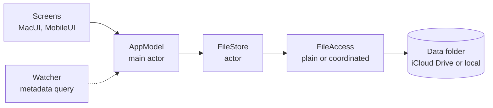

# Architecture

Time Tracker is a menu bar app for the Mac, with an iPhone and iPad app that shares its data. Everything lives in readable JSON files in iCloud Drive or a local folder. The apps never use the network themselves: they're sandboxed without the outgoing-network entitlement, and the system syncs iCloud Drive.

## Layout

| Path | What it holds |
| --- | --- |
| `Mac/`, `iOS/` | The two app targets: entry point, Info.plist, entitlements and assets. They contain almost no code. |
| `Packages/TrackerKit` | The app layer on Apple platforms. `TrackerKit` has the shared app model, storage, iCloud sync and the views both apps use; `MacUI` and `MobileUI` have each app's screens; `MacUITests` draws the Mac screens with sample data. |
| `Packages/TrackerCore` | The data model, file format, merging, the timer and overlap rules, reports, CSV and backups. Plain Swift that also builds and tests on Linux. |
| `TimeTracker.xcodeproj` | The Xcode project, with the `TimeTracker` (macOS) and `TimeTrackerMobile` (iOS) targets. |
| `docs/` | These documents. |

## How the pieces fit

Screens talk only to the app model; only the file store touches disk.

- **AppModel** (`TrackerKit`) runs on the main actor. It keeps every client, project and entry in memory in a `Ledger`, runs edits, registers undo, ticks once a minute for running timers, and schedules saves. Years of entries come to a few megabytes.
- **Ledger** (`TrackerCore`) holds all records by id. Its edit methods stamp what changed and report which files need saving; its merge methods combine copies from files and other devices.
- **FileStore** (`TrackerCore`) is an actor, so file work never blocks the main thread. It wraps `Folder`, which loads every file and saves each one as a read-merge-write.
- **FileAccess** is the small protocol `Folder` uses to reach the disk: plain file access for the local folder and tests, and `NSFileCoordinator` for iCloud.
- **Watcher** (`TrackerKit`) runs a metadata query on the iCloud folder, asks iCloud to download missing files, resolves conflicting versions, and tells the model to reload when another device changes something.

## Screens

The Mac app:

- **Menu bar:** the stopwatch icon with the running timer's hours and minutes. Its popover starts, stops and switches timers, sets the start back or stops at an earlier time, starts from a note and project, and lists recent project and tag combinations to switch to.
- **Main window:** a sidebar with the day **Timeline** (drag to move and resize, double-click to add), the **Entries** table with its inspector, **Reports** with a chart and CSV export, **Clients & Projects**, and **Tags**. The toolbar shows the running timer.
- **Settings:** iCloud, the first day of the week, launch at login, and buttons that show the data and the backups in Finder.

The iOS app has four tabs: **Timer**, **Entries** by day with a form to edit each, **Reports** with the CSV in the share sheet, and **Settings** with clients and projects.

Views both apps use live in `TrackerKit`: the report summary, chart and groups, the project label and picker, tag capsules, and a text field that commits on Return or when it loses focus, so typing doesn't make an undo step per keystroke.

## Permissions

The Mac app has the App Sandbox, iCloud Documents for its own container, and read-write access to files the user picks, for CSV export. The iOS app has iCloud Documents. Nothing else, so the App Store privacy label can say "Data Not Collected".

## Choices

- Logic lives in the packages, where `swift test` runs it. The app targets stay thin.
- TrackerCore has no Apple-only dependencies, so its tests also run on Linux.
- There's no SwiftData or Core Data, because they store a database rather than readable files.
- The Mac app uses SwiftUI scenes: `MenuBarExtra` for the popover, a `Window` for the main window, and `Settings`. The Dock icon shows only while the main window or Settings is open.
- The minimum versions are macOS 14 and iOS 17, the first with `@Observable` and SwiftUI's inspector.
