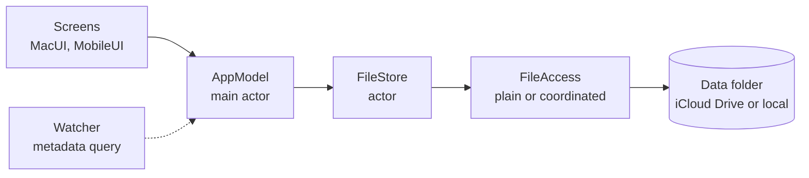

# Architecture

Time Tracker is a menu bar app for the Mac, with an iPhone and iPad app that shares its data. Everything lives in readable JSON files in iCloud Drive or a local folder. The apps never use the network themselves: they're sandboxed without the outgoing-network entitlement, and the system syncs iCloud Drive.

## Layout

| Path | What it holds |
| --- | --- |
| `Mac/`, `iOS/` | The two app targets: entry point, Info.plist, entitlements and assets. They contain almost no code. |
| `Packages/TrackerKit` | The app layer on Apple platforms. `TrackerKit` has the shared app model, storage, iCloud sync and the views both apps use; `MacUI` and `MobileUI` have each app's screens. Every screen has previews with the sample data in `PreviewData`. |
| `Packages/TrackerCore` | The data model, file format, merging, the timer and overlap rules, reports and the entry filter they share with the entries table, CSV export and import, turning calendar events into entries, and backups. Plain Swift that also builds and tests on Linux. |
| `TimeTracker.xcodeproj` | The Xcode project, with the `TimeTracker` (macOS) and `TimeTrackerMobile` (iOS) targets. |
| `docs/` | These documents. |

## How the pieces fit

```mermaid
flowchart LR
  V[Screens<br/>MacUI, MobileUI] --> M[AppModel<br/>main actor]
  M --> S[FileStore<br/>actor]
  S --> A[FileAccess<br/>plain or coordinated]
  A --> F[(Data folder<br/>iCloud Drive or local)]
  W[Watcher<br/>metadata query] -.-> M
```

Screens talk only to the app model; only the file store touches disk.

- **AppModel** (`TrackerKit`) runs on the main actor. It keeps every client, project and entry in memory in a `Ledger`, runs edits, registers undo, ticks once a minute for running timers, and schedules saves. Years of entries come to a few megabytes. It also keeps what views derive from all entries, the resolved entries, the overlaps and each project's tags, so a view listing thousands of entries doesn't work them out on every redraw. The overlaps follow the clock only while a timer runs, and views hear of them only when they change; views that list every entry don't read the clock, so they aren't rebuilt each minute. The entries table's cells show text and make their control only when it's needed: the note's text field and the project's button when the pointer comes over them, since those look like their text, and the start's and end's date fields and the tags' token field when they're clicked, until editing ends, since those don't. On macOS 26 a date picker takes about 20 ms to make and a text field about 15 ms, so a few dozen rows with a control in every cell took seconds to open.
- **Ledger** (`TrackerCore`) holds all records by id. Its edit methods stamp what changed and report which files need saving; its merge methods combine copies from files and other devices.
- **FileStore** (`TrackerCore`) is an actor, so file work never blocks the main thread. It wraps `Folder`, which loads every file and saves each one as a read-merge-write.
- **FileAccess** is the small protocol `Folder` uses to reach the disk: plain file access for the local folder and tests, and `NSFileCoordinator` for iCloud.
- **Watcher** (`TrackerKit`) runs a metadata query on the iCloud folder, asks iCloud to download missing files, resolves conflicting versions, and tells the model to reload when another device changes something.
- **Calendars** (`TrackerKit`) reads the Calendar app's calendars through EventKit, which has every account on the device, and hands their events to `CalendarImport` in TrackerCore. Which calendar goes to which project is a setting on each device, not part of the synced data.

## Screens

The Mac app:

- **Menu bar:** the stopwatch icon with the running timer's hours and minutes. Its popover starts, stops and switches timers, sets the start back or stops at an earlier time, starts from a note, project and tags, and lists recent project and tag combinations to switch to. Rows at the bottom open the main window and quit; Settings is in the app menu while the main window is open.
- **Main window:** a sidebar with the **Timeline** by day, week or month (drag to move and resize, double-click to add), the **Entries** table, edited in place and filtered by period, client, project, tag and overlaps, **Reports** with a chart and CSV export, **Clients & Projects**, where each project's inspector has its tags, GitHub repositories and calendar, and **Tags** by project. The toolbar has the timer, to start, stop or switch it, between the title and the screen's buttons. File › Import CSV… adds entries from a CSV file, File › Import Calendar Events… adds the events of calendars linked to projects, and File › Export CSV… saves every entry as a CSV file.
- **Settings:** iCloud, the first day of the week, launch at login, and buttons that show the data and the backups in Finder.

The iOS app has four tabs: **Timer**, **Entries** by day with a form to edit each, **Reports** with the CSV in the share sheet, and **Settings** with clients and projects, each with its tags, GitHub repositories and calendar, and calendar and CSV import.

Views both apps use live in `TrackerKit`: the report summary, chart and groups, the project label and picker, tag capsules, and a text field that commits on Return or when it loses focus, so typing doesn't make an undo step per keystroke.

## Permissions

The Mac app has the App Sandbox, iCloud Documents for its own container, read-write access to files the user picks, for CSV export and import, and calendars. The iOS app has iCloud Documents. Both ask for full access to calendars when the user allows it in a project's settings, since EventKit can't give access to single calendars. GitHub links open in the browser, so the apps still never use the network. Calendar data never leaves the device except as the entries imported, so the App Store privacy label can still say "Data Not Collected".

## Choices

- Logic lives in the packages, where `swift test` runs it. The app targets stay thin.
- TrackerCore has no Apple-only dependencies, so its tests also run on Linux.
- There's no SwiftData or Core Data, because they store a database rather than readable files.
- The Mac app uses SwiftUI scenes: `MenuBarExtra` for the popover, a `Window` for the main window, and `Settings`. The Dock icon shows only while the main window or Settings is open.
- The minimum versions are macOS 14 and iOS 17, the first with `@Observable` and SwiftUI's inspector.
