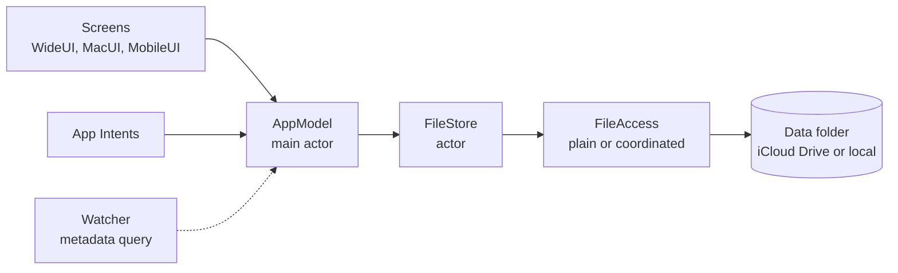

# Architecture

Time Tracker is a menu bar app for the Mac, with an iPhone and iPad app that shares its data. Everything lives in readable JSON files in iCloud Drive or a local folder. The apps never use the network themselves: they're sandboxed without the outgoing-network entitlement, and the system syncs iCloud Drive. (Debug builds are the exception: they can send in-app feedback, and the Mac's get the entitlement for it. See the README's Feedback.)

## Layout

| Path | What it holds |
| --- | --- |
| `App/` | The app target, which builds for macOS and for iOS: the entry point, which opens the Mac's or iOS's scenes, the App Shortcuts, an entitlements file for each platform (and the Mac's Debug builds, which may reach the network for in-app feedback), and the assets. It contains almost no code. |
| `Shared/` | The App Intents, built into the app and into the widget extension: start a timer from a line, stop it, and open the command line. |
| `Widgets/` | The iOS widget extension: the running timer's Live Activity, and the controls for Control Center, the Lock Screen and the Action button. |
| `Packages/TrackerKit` | The app layer on Apple platforms. `TrackerKit` has the shared app model, storage, iCloud sync, the design's colors and parts, the screen logic every screen uses, and the views the Mac's and iOS's screens share. `WideUI` has the wide window's screens, which the Mac's main window and a wide iPad window both show. `MacUI` has the rest of the Mac app: the menu bar, the shortcut's panel, the main window around the wide screens, and Settings. `MobileUI` has the iPhone's screens and the iOS app around them. `TimerActivity` has the Live Activity's attributes, which the app and the extension share. Every screen has previews with the sample data in `PreviewData`. |
| `Packages/TrackerCore` | The data model, file format, merging, reading the command line and carrying it out, what needs correcting and its fixes, the timer and overlap rules, reports and typed reports, CSV export and import, turning calendar events into entries, and backups. Plain Swift that also builds and tests on Linux. |
| `project.yml` | The Xcode project's XcodeGen spec (`make project` generates `TimeTracker.xcodeproj`, which isn't in git): one multiplatform app target and scheme, `TimeTracker`, for the Mac, iPhone and iPad, and the iOS widget extension it embeds, `TimeTrackerWidgets`. Settings that differ, such as the entitlements and the Info.plist keys of each platform, are set per SDK. |
| `Config/` | The two Info.plists, outside the synchronized folders so neither is copied in as a resource. |
| `Makefile` | The commands every j23n app has (j23n/apple-ci's build contract): `make project`, `test`, `build`, `ci-linux`, `ci-macos`. |
| `docs/` | These documents. |

## How the pieces fit

```mermaid
flowchart LR
  V[Screens<br/>WideUI, MacUI, MobileUI] --> M[AppModel<br/>main actor]
  I[App Intents] --> M
  M --> S[FileStore<br/>actor]
  S --> A[FileAccess<br/>plain or coordinated]
  A --> F[(Data folder<br/>iCloud Drive or local)]
  W[Watcher<br/>metadata query] -.-> M
```

Screens and intents talk only to the app model; only the file store touches disk.

- **AppModel** (`TrackerKit`) runs on the main actor. There's one for the app, `AppModel.shared`, made on first use, since an App Intent can run before any window opens; starting it again waits for the first load. It keeps every client, project and entry in memory in a `Ledger`, runs edits, registers undo, ticks once a minute for running timers, and schedules saves. Years of entries come to a few megabytes. It also keeps what screens derive from all entries: the resolved entries, each project's tags and each day's time by project, so a screen showing a month doesn't work them out on every redraw, and a revision number that changes with the data, for screens to recompute what they keep. It works out the projects lists' figures, `projectStats`, when they're first read after the data or the time changed, and keeps them for the redraws in between. Its `request` passes a window what another part of the app asks of it: a line for the command line, as from the projects list or the intent that opens the command line, or, on the Mac, Settings' imports and export for the main window.
- **The command line:** `CommandReading` (`TrackerCore`) reads a line against the ledger: what Return and Option-Return would do, the words' kinds for coloring them, what's wrong with it, and a completion. `Ledger.perform` carries a command out, and `CommandPreview` carries it out on a copy to say what would change. Next to the reader, `Ledger.line(for:today:)` writes an entry as the line that reads back as it, for changing the entry by typing. `CommandLineModel` (`TrackerKit`) holds a line as it's typed, with its reading, its preview, the entries it lists and the earlier lines, and what Return and Escape do with it, for the Mac's fields and the iPhone's, and `EntryLineModel` holds an entry's line as it's changed; each keeps its suggestions, and the one Tab takes, in a `LineSuggestionState`.
- **Corrections:** `Corrections` (`TrackerCore`) finds what needs correcting on some days and the fixes for each, and applies the suggested ones one after another. `WeekModel` (`TrackerKit`) works out the days a screen shows, their corrections, what each suggestion would change and the totals with them, once when the data or the days change, not on every redraw, and applies or skips a correction for the screen.
- **Reports:** `Report` (`TrackerCore`) has the figures and groups of some days; `ReportQuery` reads a typed report. `ReportState` (`TrackerKit`) holds a report screen's days, filters and grouping, and works out the report, the comparison with the days before and each day's time when the screen first reads them, and again only after something they depend on has changed.
- **Shared views:** what the Mac's and iOS's screens both draw is written once, with each platform's look under `#if` where it differs. In `TrackerKit`, `ImportViews.swift` has the CSV and calendar import sheets, `SharedViews.swift` the storage notices, and `Design/CommandBar.swift` the command line's suggestions, running timer and preview: `SuggestionStrip`, `RunningTimerLabel` and `CommandPreviewView`. `CommandDetails` in `WideUI` puts them together with the entries found and the keys, as what's under the Mac's command lines: in the popover, the shortcut's panel and the main window, which shows it in a box under its line while the line has the keyboard. `CommandText.placeholder` is what every empty command line says. `SettingsParts.swift` has the parts of Settings that each platform lays out its own way: the iCloud Drive toggle with its alert, Back Up Now, the words for where the data is and whether it's saved, `deviceName`, and the week-start picker. `Design/ReportViews.swift`, `Design/ProjectViews.swift` and `Design/DayGridParts.swift` have the parts of the reports, the project pages and the day grids. The iPhone also draws three views from `WideUI`: the command line's field, `CommandField`, its chips, `ChipLabel`, at their size for touch, and an entry's menu, `EntryMenu`, with icons.
- **Ledger** (`TrackerCore`) holds all records by id. Its edit methods stamp what changed and report which files need saving; its merge methods combine copies from files and other devices.
- **FileStore** (`TrackerCore`) is an actor, so file work never blocks the main thread. It wraps `Folder`, which loads every file and saves each one as a read-merge-write.
- **FileAccess** is the small protocol `Folder` uses to reach the disk: plain file access for the local folder and tests, and `NSFileCoordinator` for iCloud.
- **Watcher** (`TrackerKit`) runs a metadata query on the iCloud folder, asks iCloud to download missing files, resolves conflicting versions, and tells the model to reload when another device changes something.
- **Calendars** (`TrackerKit`) reads the Calendar app's calendars through EventKit, which has every account on the device, and hands their events to `CalendarImport` in TrackerCore, for corrections and for importing. Which calendar goes to which project is a setting on each device, not part of the synced data, as are the appearance, the shortcut, the corrections skipped and the lines typed, in `Preferences`.

## Screens

The Mac app:

- **Menu bar:** the stopwatch icon with the running timer's time, and its project if chosen, marked when something needs correcting. Its popover is the command line, with the running timer over it and what the line would do under it. A shortcut chosen in Settings opens the same command line in a panel over any app.
- **Main window:** a bar with Back and Forward, the zoom, and the command line with the running timer, which shows what it would do under it as the popover does, over the **day** or **week**, with what needs correcting drawn in place and listed beside it, the **month** or **year** as a report with its statement, and the **projects**, each with a page. File › Import CSV… and Import Calendar Events… add entries, and Export CSV… saves them all. The View menu has the zooms, ⌘1 to ⌘5, and Back and Forward.
- **Settings:** General, for the appearance, the shortcut, the command line and the menu bar, and Data, for where the data is, its files, backups, calendars, and importing and exporting.

The iOS app is one app for iPhone and iPad:

- **iPhone:** four tabs, **Today**, **Week** with its corrections one at a time in a panel at the bottom, **Month** as a report, and **Projects**, each with a page and its settings, and the app's Settings behind the gear. The command line floats over the tab bar and opens over the screen.
- **iPad:** a window at least 960 points wide shows the Mac's main window, from `WideUI`, with Settings at the end of the bar; a narrower one, as in Split View or Slide Over, shows the iPhone's tabs. The layout follows the window, so each window of the app picks its own.
- **Outside the app:** the Live Activity, the controls, and the intents Siri and Shortcuts offer.

## Permissions

The Mac app has the App Sandbox, iCloud Documents for its own container, read-write access to files the user picks, for CSV export and import, and calendars. The iOS app has iCloud Documents, and shows a Live Activity while a timer runs. Both ask for full access to calendars when the user allows it, since EventKit can't give access to single calendars. GitHub links open in the browser, so the apps still never use the network. Calendar data never leaves the device except as the entries imported, so the App Store privacy label can still say "Data Not Collected".

## Choices

- Logic lives in the packages, where `swift test` runs it. The app target stays thin.
- TrackerCore has no Apple-only dependencies, so its tests also run on Linux.
- There's no SwiftData or Core Data, because they store a database rather than readable files.
- The Mac app uses SwiftUI scenes: `MenuBarExtra` for the popover, a `Window` for the main window, and `Settings`. The Dock icon shows only while the main window or Settings is open. The shortcut is a Carbon hot key, which needs no accessibility permission.
- The type is the system's: SF Pro with digits of even width for times and totals, and SF Mono only in the command line. Colors come in pairs for light and dark, chosen on each device.
- The minimum versions are macOS 14 and iOS 17, the first with `@Observable` and SwiftUI's key presses. The controls need iOS 18, where they're offered.
- App Intents live in the app target and the extension, where the build reads their metadata; in the app they call into `MobileUI`. Start and Stop are Live Activity intents, so they run in the app, where the data is, even from the Lock Screen or Control Center.
